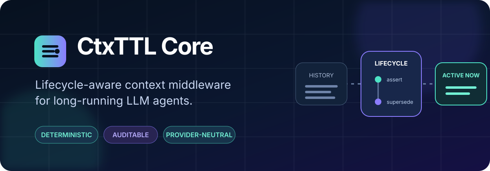
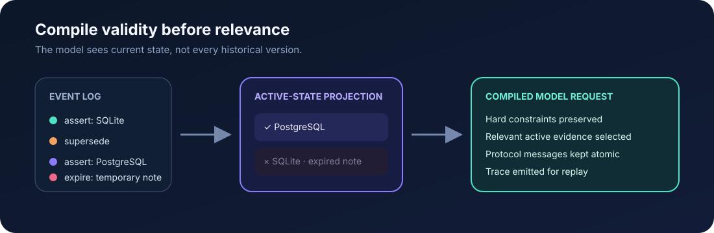

<div align="center">
  

  <br />

  [](https://github.com/qinghuanandejiangshi/CtxTTL-OSS/actions/workflows/ci.yml)
  [](https://www.python.org/)
  [](CHANGELOG.md)
  [](LICENSE)

  **Stop sending every historical state to the model. Compile the state that is valid now.**

  [Quick start](#quick-start) · [How it works](#how-it-works) · [Integration](#integration-acceptance) · [Docs](docs/README.md) · [中文](README.zh-CN.md)
</div>

---

CtxTTL Core is lifecycle-aware context middleware for long-running LLM agents. It gives facts,
decisions, constraints, corrections, and temporary instructions explicit lifecycles, then compiles
a deterministic, budget-bounded model request from the active state.

It is **not** another Agent framework. Keep your planner, tools, model provider, and retrieval
stack. Add CtxTTL once at the context boundary through its universal OpenAI-compatible protocol,
compile-only HTTP endpoint, MCP control plane, or provider-neutral Python port.

## The problem

A transcript is an audit trail—not necessarily valid working state.

```text
Turn 4   "Use SQLite."                     ← once valid
Turn 19  "Production requires PostgreSQL." ← supersedes Turn 4
Turn 37  "What database did we choose?"
```

Passing both statements makes the model resolve lifecycle state probabilistically. CtxTTL records
the correction explicitly, projects the active state transactionally, and compiles only the
applicable evidence for Turn 37.

| Growing-history behavior | CtxTTL behavior |
| --- | --- |
| Old and new decisions coexist | `supersede` leaves one active decision |
| Temporary instructions linger | time and turn leases expire explicitly |
| Retrieval can recover stale text | retrieval is isolated from authoritative state |
| Token pressure silently drops context | hard constraints fail closed |
| Agent integration owns memory logic | adapters call a provider-neutral context port |
| Failures are difficult to explain | every compilation emits a replayable trace |

## How it works

<p align="center">
  
</p>

The core pipeline is intentionally small:

1. **Record** lifecycle events such as `assert`, `supersede`, `retract`, and `expire`.
2. **Project** those events into transactionally consistent active state.
3. **Filter** by session, task, user, turn, scope, authority, and applicability.
4. **Compile** hard constraints, protocol-bound recent messages, and relevant soft evidence under
   the request budget.
5. **Trace** the decision so the exact request can be inspected and replayed.

## Quick start

### 1. Install

<details open>
<summary><strong>Windows PowerShell</strong></summary>

```powershell
py -3.11 -m venv .venv
.\.venv\Scripts\python.exe -m pip install -e ".[dev]"
Copy-Item .env.example .env
```

</details>

<details>
<summary><strong>macOS / Linux</strong></summary>

```bash
python3.11 -m venv .venv
. .venv/bin/activate
python -m pip install -e '.[dev]'
cp .env.example .env
```

</details>

Set `CTXTTL_UPSTREAM_API_KEY` and the upstream model settings in `.env`, then start the service:

```powershell
.\.venv\Scripts\python.exe -m ctxttl
```

On macOS/Linux, use `python -m ctxttl` after activating the environment.

### 2. Assert state, then ask

```python
import httpx

headers = {
    "X-CtxTTL-Session-ID": "demo-session",
    "X-CtxTTL-Agent-ID": "demo-agent",
    "X-CtxTTL-Project-ID": "demo-project",
    "X-CtxTTL-Task-ID": "demo-task",
}

with httpx.Client(base_url="http://127.0.0.1:8765", headers=headers) as client:
    client.post(
        "/v1/context/items",
        json={
            "kind": "decision",
            "scope": "task",
            "subject": "project.database",
            "value": "PostgreSQL",
            "reason": "production requirement",
        },
    ).raise_for_status()

    response = client.post(
        "/v1/chat/completions",
        json={
            "model": "your-model",
            "messages": [{"role": "user", "content": "Which database did we choose?"}],
        },
    )
    response.raise_for_status()
    print(response.json())
```

The complete runnable version is [`examples/quickstart.py`](examples/quickstart.py). See the
[structured ingestion contract](docs/structured-ingestion.md) and
[Chat Completions proxy](docs/chat-completions-proxy.md) for lifecycle updates, identity headers,
streaming, and replay.

## Connect an existing Agent

CtxTTL is one protocol boundary, not a collection of framework adapters:

| What the existing Agent supports | Integration path |
| --- | --- |
| OpenAI-compatible base URL and custom headers | Point it to `http://127.0.0.1:8765/v1` |
| A hook before the model client | Call `POST /v1/context/compile`, then send the returned payload |
| MCP | Add the optional lifecycle control plane; keep one of the data paths above for enforcement |

Use the same stable coordinates on every path:

```text
X-CtxTTL-Session-ID: run-42
X-CtxTTL-Agent-ID: researcher
X-CtxTTL-Project-ID: project-alpha
X-CtxTTL-Task-ID: investigate-regression
```

Different Agent IDs can share task/project state while retaining private Agent/session state. New
platforms use these standard headers and the generic `/v1/responses`, `/v1/chat/completions`, or
`/v1/context/compile` endpoint; they do not require a new Core adapter.

Follow the [existing-Agent quick integration guide](docs/quick-agent-integration.md) for Python,
transparent-proxy, compile-only, MCP, scope-selection, and acceptance examples. The
[universal protocol](docs/agent-integrations.md) defines the full isolation and security boundary.

## Use from Codex through MCP

The independently packaged MCP control plane lets Codex explicitly manage lifecycle state without
adding the MCP SDK to Core:

```powershell
.\.venv\Scripts\python.exe -m pip install -e packages\ctxttl-mcp
$env:CTXTTL_MCP_BEARER_TOKEN = "replace-with-a-long-random-token"
.\.venv\Scripts\ctxttl-mcp.exe
```

In another terminal:

```powershell
$env:CTXTTL_MCP_TOKEN = "replace-with-the-same-token"
codex mcp add ctxttl --url http://127.0.0.1:8766/mcp --bearer-token-env-var CTXTTL_MCP_TOKEN
```

MCP is the explicit state control plane; it does not intercept every model request. Read the
[MCP integration guide](docs/mcp-integration.md) for its seven tools, security boundary, logs, and
the distinction from the Responses API data plane.

## Route Codex model calls through CtxTTL

The additive `POST /v1/responses` endpoint is the transparent data plane for Codex and other
Responses clients. Configure a custom provider with `base_url = "http://127.0.0.1:8765/v1"`,
`wire_api = "responses"`, and environment-backed CtxTTL identity headers. Requests with explicit
stateless `input` are lifecycle-compiled before they reach the upstream provider; JSON and SSE
responses are relayed without rewriting. `GET /v1/models` separately relays Codex capability
discovery without entering the context compiler.

CtxTTL deliberately rejects compile-mode requests that reference hidden upstream history through
`previous_response_id`, hosted conversations, or hosted prompts. See the
[Responses proxy guide](docs/responses-api-proxy.md) for the complete Codex configuration,
compatibility boundary, security requirements, and token/latency telemetry.

## Current capabilities

| Layer | Capability |
| --- | --- |
| Lifecycle | assert, supersede, retract, expire, time leases, turn leases |
| State | transactional SQLite event log and active-state projection |
| Compiler | protocol-aware recent reserve, hard constraints, soft-evidence budgeting |
| Memory | conversation archive plus isolated FTS5 retrieval |
| Integration | Universal Agent identity protocol, OpenAI-compatible data plane, Python port, MCP control plane |
| Observability | session-isolated traces and exact replay with content capture |
| Evaluation | model-free regressions and resumable provider-neutral model harness |

The modules are separated by ports and contracts so storage, retrieval, tokenization, providers,
and Agent runtimes can be replaced independently. A platform that can set HTTP headers uses the
same endpoint without a dedicated adapter. Read [the universal Agent protocol](docs/agent-integrations.md)
and [ARCHITECTURE.md](ARCHITECTURE.md) for the
dependency rules.

## Integration acceptance

| Case | What was exercised | Result boundary |
| --- | --- | --- |
| OpenAI-compatible Agent client | Base URL replacement, identity headers, buffered and streaming requests | Requests compile and relay through the public protocol boundary |
| Codex local integration | Responses data plane, MCP control plane, model discovery, SSE, traces, and execution telemetry | Connection accepted; the short smoke session was not a token-performance test |
| Universal multi-Agent contract | Two Agents, private Agent state, shared task/project state, public HTTP only | Isolation and intentional sharing passed in the reproducible test suite |

Read the [case studies and their limitations](docs/integration-cases.md). They establish protocol
and isolation behavior, not a general token, latency, cost, or model-quality advantage.

## Deterministic verification

The model-free benchmark is available without credentials:

```powershell
.\.venv\Scripts\python.exe -m ctxttl.benchmarks.cli benchmarks\ctxttlbench.jsonl
```

It measures lifecycle selection and replay mechanics—not model answer quality.

## Design principles

- **Validity before relevance.** An expired or superseded record is not revived because it matches
  a query.
- **Explicit over inferred.** Critical corrections and constraints use typed events, not hidden
  summarizer behavior.
- **Fail closed.** Required context that cannot fit is an error, not a silent omission.
- **Provider neutral.** Lifecycle semantics do not depend on one model or Agent runtime.
- **Evidence bounded.** Engineering tests, development observations, and release claims remain
  separate.

CtxTTL does not claim to be the first prompt-compression or Agent-memory system. Its focus is a
cohesive implementation of explicit lifecycle semantics, deterministic projection and compilation,
replaceable boundaries, and auditable replay. See [known limitations](docs/known-limitations.md).

## Develop and verify

```powershell
.\.venv\Scripts\python.exe -m ruff check .
.\.venv\Scripts\python.exe -m ruff format --check .
.\.venv\Scripts\python.exe -m pytest tests packages\ctxttl-mcp\tests
.\.venv\Scripts\python.exe scripts\check_repository_hygiene.py
```

The same checks run on Python 3.11, 3.12, and 3.13 in GitHub Actions. macOS/Linux uses `python` and
forward-slash paths.

## Documentation

| Start here | Go deeper |
| --- | --- |
| [Documentation index](docs/README.md) | [Context compiler](docs/context-compiler.md) |
| [Quick Agent integration](docs/quick-agent-integration.md) | [Integration case studies](docs/integration-cases.md) |
| [Universal Agent protocol](docs/agent-integrations.md) | [State and storage](docs/context-state-storage.md) |
| [Responses proxy](docs/responses-api-proxy.md) | [Observability and replay](docs/observability.md) |
| [Evaluation harness](docs/model-evaluation.md) | [Repository and evidence policy](docs/repository-policy.md) |
| [Security](SECURITY.md) | [Public roadmap](docs/roadmap.md) |

Core documentation has English and Simplified Chinese locale packs. Additional languages are an
independent documentation change through [`docs/locales.toml`](docs/locales.toml); no runtime
translation service is required.

## Contributing

Issues and focused pull requests are welcome. Please read [CONTRIBUTING.md](CONTRIBUTING.md), keep
runtime-specific behavior behind an adapter, and include contract tests for observable behavior.

CtxTTL Core is available under the [Apache License 2.0](LICENSE).
